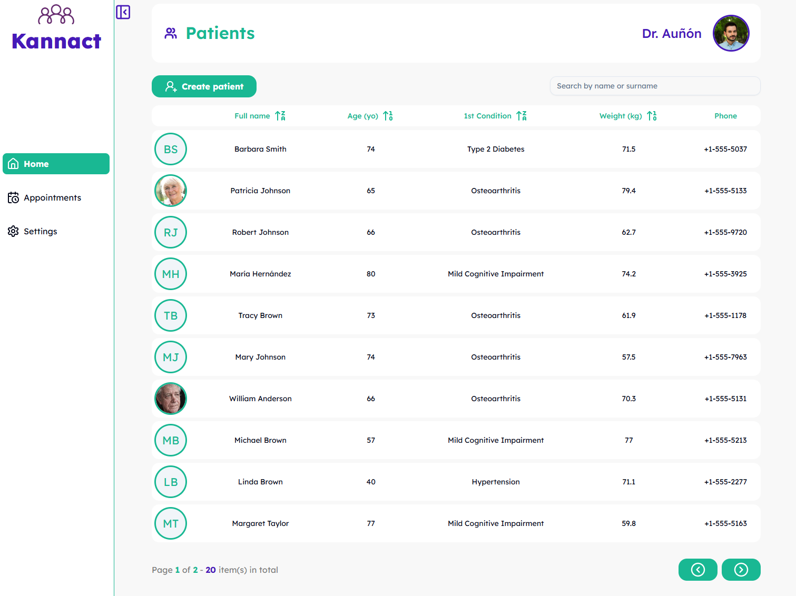

# Kannact challenge



## Table of contents

- [Introduction](#introduction)
- [Technologies](#technologies)
  - [Routing](#routing)
  - [State management](#state-management)
  - [Backend](#backend)
  - [Bundling](#bundling)
  - [Linting and formatting](#linting-and-formatting)
  - [Styling and UI](#styling-and-ui)
- [Architecture](#architecture)
- [Features](#features)
- [TODOs](#todos-in-order-of-importance)
- [Starting the project](#starting-the-project)
- [TL;DR](#tldr)

## Introduction

This project consists of creating a simple dashboard for tracking patients and coaching notes. The dashboard is built using React and TypeScript and is composed of 2 views: one to list all the patients and another one to manage an specific patient.

## Technologies

The webapp is using React 19 along with different libraries to fulfill the demands of a modern browser application:

### Routing

The routing system relies on `@tanstack/react-router`, which has a great advantage in terms of performance, since it is able to fetch data before mounting the component; contrarily to the traditional approach. The router configuration and routes with preloaders are defined in `src/app/routes`.

### State management

In combination with `@tanstack/react-router`, the app state is completely managed by `@tanstack/react-query` since allows caching the get requests and store them internally to avoid multiple requests. Additionally, the cached data is persisted in the browser locale storage, so the data is available even if the user reloads the page.

### Backend

All the requests to the backend are mocked with `axios-mock-adapter` and can be consulted in the `src/api/` path. The data provided by the fake API is declared in a big JS object available in `src/api/users.ts`. The contents of this object are saved into the local storage on the first request and manipulated lately on next requests, so the browser local storage acts as a backend database.

### Bundling

_Vite_ is in charge of building the webapp since is fast and simpler alternative nowadays when working with simple react applications.

### Linting and formatting

By using the traditional combination of _ESlint_ and _Prettier_.

### Styling and UI

For the sake of speeding the development of the application, some components belong to the _Shadcn_ library, which allows creating specific components instead of installing a big collection. An example of these components are the date picker, the dialog and the tables. The tables also make use of `@tanstack/react-table` easing the introduction of features like sorting and filtering columns.

Despite that the _Shadcn_ components are styled following _tailwindCSS_ rules, some of them have been restyled using pure CSS following **BEM** rules.

# Architecture

The webapp follows the principles of the _Hexagonal Architecture_, separating the application domain (patients, users, session notes) from the rest of the layers. This is how the app is structured:

```
src/
|- app/
|   |- routes/...    <- The routing system and routes
|        | - routesPath.ts   <- Declares the available paths in the app, no magic strings
|
|- domain/           <- Business logic, basically interfaces
|    |- users.ts
|    |- medical.ts
|    |- shared.d.ts  <- Special types like UUID, DateTimeString, Email

|- application/      <- Use cases to orchestrate domain entities with services
|    |- createPatient.ts
|    |- getPatients.ts ...
|
|- services/         <- External adapters
|    |- alert.adapter.ts
|    |- api.adapter.ts
|    |- storage.adapter.ts
|
|- ui/               <- React components
|   |- components/   <- Simple components
|   |      |- form...
|   |      |- patients/...  <- Components related to patients logic
|   |      |- skeletons...  <- Components used as fallback when the real component is being loaded
|   |
|   |- layouts/      <- Full screen components, used in pages, to arrange minor components
|   |    |- HomeLayout/
|   |    |- PatientLayout/
|   |
|   |- pages/        <- First component loaded when going to a specific route
|       |- PatientsPage.tsx   <- Lazy loaded in '/'
|       |- PatientPage.tsx    <- Loaded in '/patients/:id'
|- App.tsx           <- Providers and router
|- main.tsx          <- Entry point

```

## Features

This are the features on each page of the application:

- The common layout consists of a left _sidebar_ with a vertical navigation menu (just the **Home** is working at this moment). On the top part of the window there is a sticky _topbar_ which indicates the current navigation and a space reserved for the authenticated user.

- On the home page, the coach can:

  - **list** all the patients.
  - **sort** them alphabetically, by age, by their primary health conditions or by their weight.
  - **search** patients by the full name.
  - The coach can **create new patients** as well.

- On the patient detail page, the coach can:
  - Consult **more information** about the patient, such as the email, phone, sex, weight and height.
  - **Edit** this data.
  - Since many patients are elderly, the coach can also see the information of the patient's emergency contact. **Edit** and **delete** an emergency contact.
  - See the **latest session notes** involving the patient.
  - **Create**, **edit** and **delete** these session notes.

## TODOs (in order of importance)

This is a list of all the features/work I would have included to be happier

1. [ ] **Tests**. Including unitary tests with _vitest_. First I would test the logic abstractions of the **application** layer, taken care of those related to the patients management first. The UI components can be tested by passing dummy data to them and checking they render the right properties. E2E tests with tools like _PlayWright_ will test an entire user flow from a more realistic perspective, like the one creating a patient. However I find it unnecessary for this project. Tests with a mocked DOM are enough to test small logic flows.
2. [ ] **Charts**. In the mocked user data I have included several health metrics related to the kind of patients a health coach could treat. There are metrics like blood glucose, blood pressure, heart rate and daily steps.
3. [ ] **Show and edit** the patient's medication. There is information related to medication and doses in the mocked data that I would have liked to process.
4. [ ] **Patient actions in the patients view**. Add actions to the table so the coach can edit and delete the patients without going to the detail page.
5. [ ] **Present the session notes in a calendar** instead of a list with cards. A monthly calendar with highlighted days where you can click and see those notes.
6. [ ] **Add some type of login and authentication**. Even though the backend is mocked, it would be great to have some login page. Especially taking into account that the app is basically a backoffice.
7. [ ] **I18n**. Include translations.

## Starting the project

There are several ways of launching the project, but first you need to create a `.env` file with this environment variable `VITE_BASE_URL=<the-url-where-your-app-is-running>` since it is required to mock the backend.

1. Install the dependencies with `yarn install` and launch the development version with `yarn dev`.
2. Build a docker container with `docker compose -f "docker-compose.dev.yml -build --d app` or just `make app-dev`
3. Jump to the [TL;DR](#tldr) section.

## TL;DR

Just go to https://kan-patient-dashboard.netlify.app and play with the app 🚀.

**_Enjoy!_**
